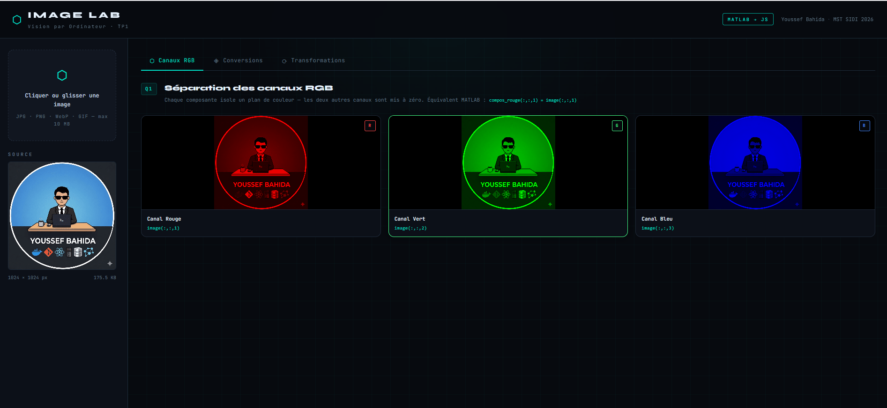
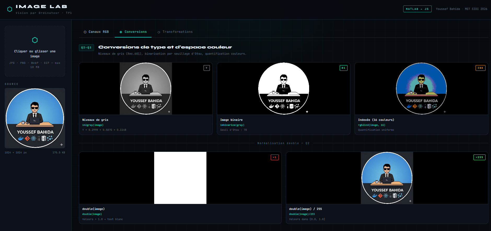
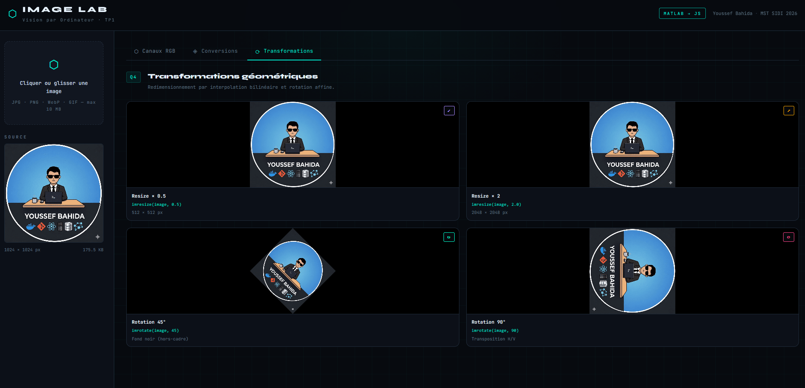

<div align="center">


<br/><br/>

```
  ⬡  IMAGE LAB
     Vision par Ordinateur · TP1
```

# Image Processing Laboratory

**A full reimplementation of MATLAB TP1 image processing operations —  
directly in the browser using native Canvas API. No backend. No dependencies.**

[🌐 Live Demo](https://image-lab-nine.vercel.app) · [📂 Source Code](https://github.com/youssef-bahida/Portfolio/tree/Image-Processing) · [👤 Youssef Bahida](https://github.com/youssef-bahida)

</div>

---

## 📸 Screenshots

### RGB Channel Separation


### Color Space Conversions


### Geometric Transformations


---

## 🧠 What This Project Does

This project translates every MATLAB operation from a Computer Vision lab assignment into pure JavaScript using the browser's native Canvas API. Each algorithm is documented with its mathematical foundation and its direct MATLAB equivalent.

| MATLAB Operation | JavaScript Implementation | Algorithm |
|---|---|---|
| `imread()` | `FileReader` + `HTMLImageElement` | File decoding |
| `image(:,:,1)` | RGBA byte array (stride 4) | Tensor slicing |
| `im2gray()` | `0.299R + 0.587G + 0.114B` | Rec.601 Luminance |
| `imbinarize()` | Otsu's method | Inter-class variance maximization |
| `rgb2ind(img,16)` | Uniform quantization per channel | Color reduction |
| `imresize()` | `imageSmoothingQuality: "high"` | Bilinear interpolation |
| `imrotate()` | Canvas affine transform | Geometric rotation |
| `subplot()` | CSS Grid + per-cell canvas | Layout system |

---

## ✨ Features

### Q1 — RGB Channel Separation
Isolates each color plane by zeroing the other two channels, matching MATLAB's matrix slicing behavior.
- Red channel `(R, 0, 0)`
- Green channel `(0, G, 0)`  
- Blue channel `(0, 0, B)`

### Q2 — Double Normalization
Demonstrates the difference between raw `double()` conversion (all white — values > 1.0) and proper `im2double()` normalization into `[0.0, 1.0]`.

### Q3 — Type Conversions
- **Grayscale** — perceptual luminance formula (Rec.601)
- **Binary** — automatic thresholding via Otsu's algorithm (maximizes inter-class variance)
- **Indexed** — color quantization to 16 colors via uniform channel discretization

### Q4 — Geometric Transforms
- Resize ×0.5 and ×2.0 with bilinear interpolation
- Rotation 45° and 90° via affine canvas transformation

---

## 🔐 Security

File upload includes multiple validation layers — because file extensions alone are **not trustworthy**:

| Layer | Method | Protects Against |
|---|---|---|
| MIME type check | `file.type` validation | Wrong format declaration |
| Magic bytes | First 4 bytes signature (`FFD8FF` for JPEG) | Extension spoofing |
| Size limit | Max 10 MB | DoS / memory attacks |
| No server | 100% client-side processing | Data leakage |

```js
// Magic bytes validation — more reliable than file extension
const signatures = {
  jpeg: [0xFF, 0xD8, 0xFF],
  png:  [0x89, 0x50, 0x4E, 0x47],
  webp: [0x52, 0x49, 0x46, 0x46],
  gif:  [0x47, 0x49, 0x46],
};
```

---

## 🏗️ Architecture

```
src/
├── App.jsx                   # Root component — global state management
├── main.jsx                  # React entry point
├── components/
│   ├── Header.jsx            # App header with branding
│   ├── ImageUploader.jsx     # Secure drag & drop upload
│   └── ResultsGrid.jsx       # Results grid (subplot equivalent)
├── utils/
│   └── imageProcessing.js   # All processing algorithms (pure functions)
└── styles/
    └── global.css            # Design system — "Lab Noir" aesthetic
```

**Architecture principles:**
- **Separation of concerns** — all processing logic isolated in `utils/`
- **Pure functions** — every transform returns a new `ImageData`, no mutation
- **Zero side effects** — components are pure renderers
- **Accessibility** — `role`, `aria-label`, full keyboard navigation

---

## 📐 Core Algorithms

### ImageData — the fundamental structure
```js
// A 100×100 RGB image = flat array of 100×100×4 = 40,000 bytes
// Layout: [R, G, B, A, R, G, B, A, ...]
const pixelOffset = row * (width * 4) + col * 4;
const R = imageData.data[pixelOffset];
const G = imageData.data[pixelOffset + 1];
const B = imageData.data[pixelOffset + 2];
```

### Otsu's Thresholding
```js
// Maximizes inter-class variance between background and foreground
// σ²_B(T) = ω_B(T) · ω_F(T) · [μ_B(T) − μ_F(T)]²
// T* = argmax σ²_B(T)   for T in [0, 255]
```

### Rec.601 Grayscale
```js
// Perceptual weights — human eye is most sensitive to green
const Y = Math.round(0.299 * R + 0.587 * G + 0.114 * B);
```

---

## 🚀 Getting Started

### Prerequisites
- Node.js ≥ 18
- npm ≥ 9

### Installation

```bash
# Clone the repository
git clone https://github.com/youssef-bahida/Portfolio.git
cd Portfolio

# Switch to the Image-Processing branch
git checkout Image-Processing

# Install dependencies
npm install

# Start development server
npm run dev
```

Open [http://localhost:5173](http://localhost:5173) in your browser.

### Build for Production

```bash
npm run build    # outputs to /dist
npm run preview  # preview production build locally
```

---

## 🌐 Deployment

This project is deployed on **Vercel** (free Hobby plan).

Every push to the `Image-Processing` branch triggers an automatic redeploy.

```bash
# Manual deploy via CLI
npm install -g vercel
vercel --prod
```

🔗 **Live:** [https://image-lab-nine.vercel.app](https://image-lab-nine.vercel.app)

---

## 🛠️ Tech Stack

| Technology | Role | Why |
|---|---|---|
| **React 18** | UI framework | Declarative rendering, hooks |
| **Vite 5** | Build tool | Instant HMR, fast builds |
| **Canvas API** | Image processing | Native pixel access, no library needed |
| **CSS Custom Properties** | Design system | Consistent theming |
| **Syne** | Display font | Technical, distinctive |
| **JetBrains Mono** | Code font | Readable monospace |

**Zero image processing dependencies** — everything is implemented from scratch using native browser APIs.

---

## 👤 Author

**Youssef Bahida**  
MST SIDI · 2026  
[github.com/youssef-bahida](https://github.com/youssef-bahida)

---

## 📄 License

MIT — free to use, modify, and distribute.

---

<div align="center">
<sub>Built with Canvas API · React · Vite · Deployed on Vercel</sub>
</div>